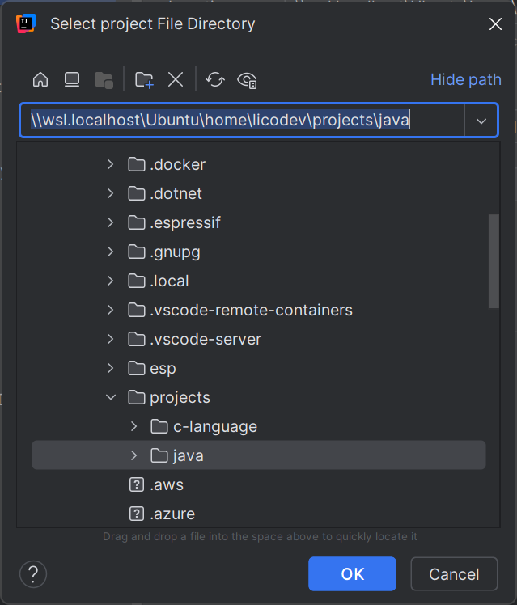
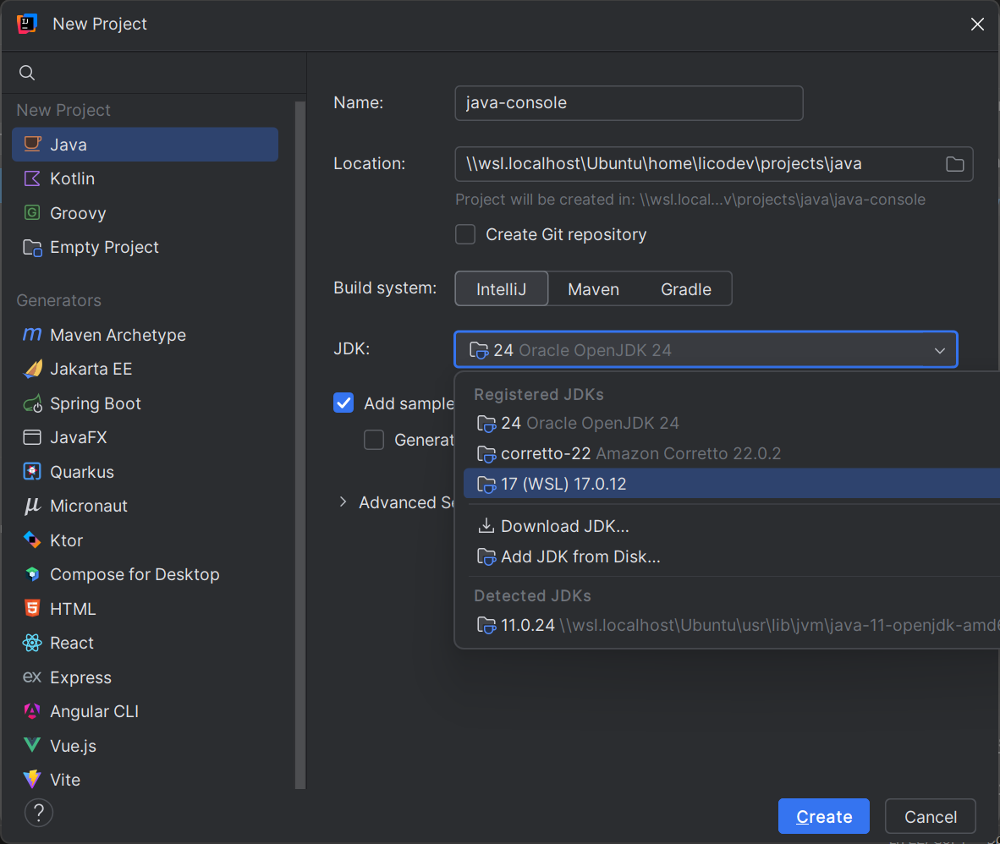
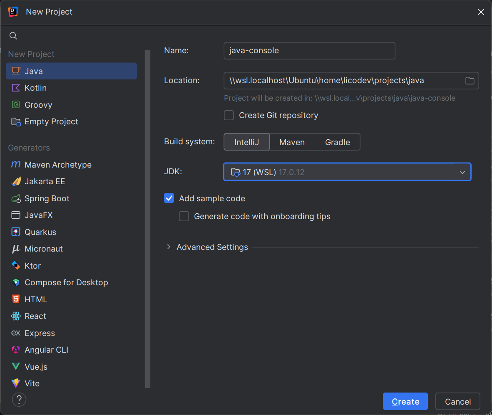
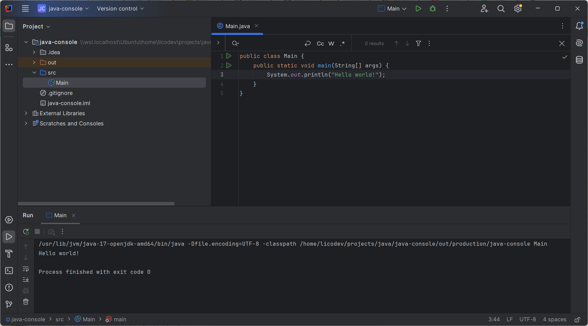

# Intellij

## Atalhos, comandos e configurações do ambiente

## Encontrar configuração

- CTRL+SHIFT+A

## Configurações essenciais de aparência:

- File -> Settings -> Appearance & Behavior -> Appearance
- File -> Settings -> Editor -> General -> Change font size with Ctrl+Mouse Wheel

## Acesso à pasta do Linux

- Settings/Preferences (Ctrl+Alt+S) -> Build, Execution, Deployment -> Trusted Locations
(adicionar pasta dos projetos)

## Para executar um projeto

É preciso criar um configuração de execução para rodar um projeto

- Add configuration
- Botão "Play"

## Limpar cache e outros

- File -> Invalidate Caches / Restart
- Apagar subpasta Jetbrains em ~/.cache

## Edição

- CTRL+Espaço (auto completar)
- ALT+INSERT (criar construtor, get/set, etc.)
- CTRL+ALT+L (auto-indentação)
- Settings/Preferences (Ctrl+Alt+S) -> Editor -> General -> Auto Import (Add unambiguous imports on the fly / Optimeze imports on the fly)

> https://www.youtube.com/watch?v=0_e9Egeyk2E

Configurando o Java no WSL com Intellij

C:\Program Files (x86)\Common Files\Oracle\Java\java8path

C:\Program Files (x86)\Common Files\Oracle\Java\javapath

~~~javascript
Esta é uma linha de código em Javascript.
~~~

~~~php
Esta é uma linha de código em PHP.
~~~

~~~html
Esta é uma linha de código em HTML.
~~~

