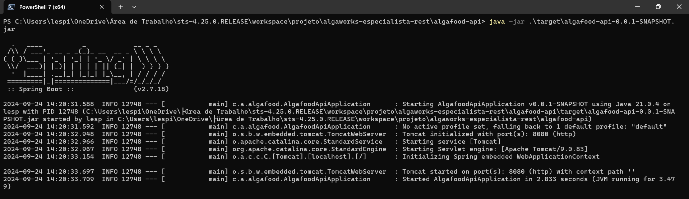

# Comandos no terminal

# Empacotamento com o Maven

```sh
[INFO] Scanning for projects...
[WARNING] The requested profile "pom.xml" could not be activated because it does not exist.
[INFO] 
[INFO] ---------------------< com.algaworks:algafood-api >---------------------
[INFO] Building algafood-api 0.0.1-SNAPSHOT
[INFO]   from pom.xml
[INFO] --------------------------------[ jar ]---------------------------------
[INFO] 
[INFO] --- resources:3.2.0:resources (default-resources) @ algafood-api ---
[INFO] Using 'UTF-8' encoding to copy filtered resources.
[INFO] Using 'UTF-8' encoding to copy filtered properties files.
[INFO] Copying 1 resource
[INFO] Copying 0 resource
[INFO] 
[INFO] --- compiler:3.10.1:compile (default-compile) @ algafood-api ---
[INFO] Changes detected - recompiling the module!
[INFO] Compiling 1 source file to C:\Users\lespi\OneDrive\Área de Trabalho\sts-4.25.0.RELEASE\workspace\projeto\algaworks-especialista-rest\algafood-api\target\classes
[INFO] 
[INFO] --- resources:3.2.0:testResources (default-testResources) @ algafood-api ---
[INFO] Using 'UTF-8' encoding to copy filtered resources.
[INFO] Using 'UTF-8' encoding to copy filtered properties files.
[INFO] skip non existing resourceDirectory C:\Users\lespi\OneDrive\Área de Trabalho\sts-4.25.0.RELEASE\workspace\projeto\algaworks-especialista-rest\algafood-api\src\test\resources
[INFO] 
[INFO] --- compiler:3.10.1:testCompile (default-testCompile) @ algafood-api ---
[INFO] Changes detected - recompiling the module!
[INFO] Compiling 1 source file to C:\Users\lespi\OneDrive\Área de Trabalho\sts-4.25.0.RELEASE\workspace\projeto\algaworks-especialista-rest\algafood-api\target\test-classes
[INFO] 
[INFO] --- surefire:2.22.2:test (default-test) @ algafood-api ---
[INFO] Downloading from central: https://repo.maven.apache.org/maven2/org/apache/maven/surefire/maven-surefire-common/2.22.2/maven-surefire-common-2.22.2.pom
[INFO] Downloaded from central: https://repo.maven.apache.org/maven2/org/apache/maven/surefire/maven-surefire-common/2.22.2/maven-surefire-common-2.22.2.pom (11 kB at 28 kB/s)
[INFO] Downloading from central: https://repo.maven.apache.org/maven2/org/apache/maven/plugin-tools/maven-plugin-annotations/3.5.2/maven-plugin-annotations-3.5.2.pom
[INFO] Downloaded from central: https://repo.maven.apache.org/maven2/org/apache/maven/plugin-tools/maven-plugin-annotations/3.5.2/maven-plugin-annotations-3.5.2.pom (1.6 kB at 71 kB/s)
[INFO] Downloading from central: https://repo.maven.apache.org/maven2/org/apache/maven/plugin-tools/maven-plugin-tools/3.5.2/maven-plugin-tools-3.5.2.pom
[INFO] Downloaded from central: https://repo.maven.apache.org/maven2/org/apache/maven/plugin-tools/maven-plugin-tools/3.5.2/maven-plugin-tools-3.5.2.pom (15 kB at 439 kB/s)
[INFO] Downloading from central: https://repo.maven.apache.org/maven2/org/apache/maven/maven-parent/31/maven-parent-31.pom
[INFO] Downloaded from central: https://repo.maven.apache.org/maven2/org/apache/maven/maven-parent/31/maven-parent-31.pom (43 kB at 1.2 MB/s)
[INFO] Downloading from central: https://repo.maven.apache.org/maven2/org/apache/maven/surefire/surefire-api/2.22.2/surefire-api-2.22.2.pom
[INFO] Downloaded from central: https://repo.maven.apache.org/maven2/org/apache/maven/surefire/surefire-api/2.22.2/surefire-api-2.22.2.pom (3.5 kB at 169 kB/s)
[INFO] Downloading from central: https://repo.maven.apache.org/maven2/org/apache/maven/surefire/surefire-logger-api/2.22.2/surefire-logger-api-2.22.2.pom
[INFO] Downloaded from central: https://repo.maven.apache.org/maven2/org/apache/maven/surefire/surefire-logger-api/2.22.2/surefire-logger-api-2.22.2.pom (2.0 kB at 98 kB/s)
[INFO] Downloading from central: https://repo.maven.apache.org/maven2/org/apache/maven/surefire/surefire-booter/2.22.2/surefire-booter-2.22.2.pom
[INFO] Downloaded from central: https://repo.maven.apache.org/maven2/org/apache/maven/surefire/surefire-booter/2.22.2/surefire-booter-2.22.2.pom (7.5 kB at 339 kB/s)
[INFO] Downloading from central: https://repo.maven.apache.org/maven2/org/apache/maven/maven-plugin-descriptor/2.2.1/maven-plugin-descriptor-2.2.1.pom
[INFO] Downloaded from central: https://repo.maven.apache.org/maven2/org/apache/maven/maven-plugin-descriptor/2.2.1/maven-plugin-descriptor-2.2.1.pom (2.1 kB at 98 kB/s)
[INFO] Downloading from central: https://repo.maven.apache.org/maven2/org/apache/maven/maven-project/2.2.1/maven-project-2.2.1.pom
[INFO] Downloaded from central: https://repo.maven.apache.org/maven2/org/apache/maven/maven-project/2.2.1/maven-project-2.2.1.pom (2.8 kB at 146 kB/s)
[INFO] Downloading from central: https://repo.maven.apache.org/maven2/org/apache/maven/maven-settings/2.2.1/maven-settings-2.2.1.pom
[INFO] Downloaded from central: https://repo.maven.apache.org/maven2/org/apache/maven/maven-settings/2.2.1/maven-settings-2.2.1.pom (2.2 kB at 121 kB/s)
[INFO] Downloading from central: https://repo.maven.apache.org/maven2/org/codehaus/plexus/plexus-interpolation/1.11/plexus-interpolation-1.11.pom
[INFO] Downloaded from central: https://repo.maven.apache.org/maven2/org/codehaus/plexus/plexus-interpolation/1.11/plexus-interpolation-1.11.pom (889 B at 47 kB/s)
[INFO] Downloading from central: https://repo.maven.apache.org/maven2/org/apache/maven/maven-profile/2.2.1/maven-profile-2.2.1.pom
[INFO] Downloaded from central: https://repo.maven.apache.org/maven2/org/apache/maven/maven-profile/2.2.1/maven-profile-2.2.1.pom (2.2 kB at 109 kB/s)
[INFO] Downloading from central: https://repo.maven.apache.org/maven2/org/apache/maven/maven-artifact-manager/2.2.1/maven-artifact-manager-2.2.1.pom
[INFO] Downloaded from central: https://repo.maven.apache.org/maven2/org/apache/maven/maven-artifact-manager/2.2.1/maven-artifact-manager-2.2.1.pom (3.1 kB at 163 kB/s)
[INFO] Downloading from central: https://repo.maven.apache.org/maven2/org/apache/maven/maven-repository-metadata/2.2.1/maven-repository-metadata-2.2.1.pom
[INFO] Downloaded from central: https://repo.maven.apache.org/maven2/org/apache/maven/maven-repository-metadata/2.2.1/maven-repository-metadata-2.2.1.pom (1.9 kB at 104 kB/s)
[INFO] Downloading from central: https://repo.maven.apache.org/maven2/backport-util-concurrent/backport-util-concurrent/3.1/backport-util-concurrent-3.1.pom
[INFO] Downloaded from central: https://repo.maven.apache.org/maven2/backport-util-concurrent/backport-util-concurrent/3.1/backport-util-concurrent-3.1.pom (880 B at 42 kB/s)
[INFO] Downloading from central: https://repo.maven.apache.org/maven2/org/apache/maven/maven-plugin-registry/2.2.1/maven-plugin-registry-2.2.1.pom
[INFO] Downloaded from central: https://repo.maven.apache.org/maven2/org/apache/maven/maven-plugin-registry/2.2.1/maven-plugin-registry-2.2.1.pom (1.9 kB at 92 kB/s)
[INFO] Downloading from central: https://repo.maven.apache.org/maven2/org/apache/maven/maven-core/2.2.1/maven-core-2.2.1.pom
[INFO] Downloaded from central: https://repo.maven.apache.org/maven2/org/apache/maven/maven-core/2.2.1/maven-core-2.2.1.pom (12 kB at 554 kB/s)
[INFO] Downloading from central: https://repo.maven.apache.org/maven2/org/apache/maven/maven-plugin-parameter-documenter/2.2.1/maven-plugin-parameter-documenter-2.2.1.pom
[INFO] Downloaded from central: https://repo.maven.apache.org/maven2/org/apache/maven/maven-plugin-parameter-documenter/2.2.1/maven-plugin-parameter-documenter-2.2.1.pom (2.0 kB at 103 kB/s)
[INFO] Downloading from central: https://repo.maven.apache.org/maven2/org/slf4j/slf4j-jdk14/1.5.6/slf4j-jdk14-1.5.6.pom
[INFO] Downloaded from central: https://repo.maven.apache.org/maven2/org/slf4j/slf4j-jdk14/1.5.6/slf4j-jdk14-1.5.6.pom (1.9 kB at 90 kB/s)
[INFO] Downloading from central: https://repo.maven.apache.org/maven2/org/slf4j/slf4j-parent/1.5.6/slf4j-parent-1.5.6.pom
[INFO] Downloaded from central: https://repo.maven.apache.org/maven2/org/slf4j/slf4j-parent/1.5.6/slf4j-parent-1.5.6.pom (7.9 kB at 396 kB/s)
[INFO] Downloading from central: https://repo.maven.apache.org/maven2/org/slf4j/slf4j-api/1.5.6/slf4j-api-1.5.6.pom
[INFO] Downloaded from central: https://repo.maven.apache.org/maven2/org/slf4j/slf4j-api/1.5.6/slf4j-api-1.5.6.pom (3.0 kB at 142 kB/s)
[INFO] Downloading from central: https://repo.maven.apache.org/maven2/org/slf4j/jcl-over-slf4j/1.5.6/jcl-over-slf4j-1.5.6.pom
[INFO] Downloaded from central: https://repo.maven.apache.org/maven2/org/slf4j/jcl-over-slf4j/1.5.6/jcl-over-slf4j-1.5.6.pom (2.2 kB at 103 kB/s)
[INFO] Downloading from central: https://repo.maven.apache.org/maven2/org/apache/maven/maven-error-diagnostics/2.2.1/maven-error-diagnostics-2.2.1.pom
[INFO] Downloaded from central: https://repo.maven.apache.org/maven2/org/apache/maven/maven-error-diagnostics/2.2.1/maven-error-diagnostics-2.2.1.pom (1.7 kB at 85 kB/s)
[INFO] Downloading from central: https://repo.maven.apache.org/maven2/org/apache/maven/maven-monitor/2.2.1/maven-monitor-2.2.1.pom
[INFO] Downloaded from central: https://repo.maven.apache.org/maven2/org/apache/maven/maven-monitor/2.2.1/maven-monitor-2.2.1.pom (1.3 kB at 63 kB/s)
[INFO] Downloading from central: https://repo.maven.apache.org/maven2/org/apache/maven/maven-toolchain/2.2.1/maven-toolchain-2.2.1.pom
[INFO] Downloaded from central: https://repo.maven.apache.org/maven2/org/apache/maven/maven-toolchain/2.2.1/maven-toolchain-2.2.1.pom (3.3 kB at 176 kB/s)
[INFO] Downloading from central: https://repo.maven.apache.org/maven2/org/codehaus/plexus/plexus-java/0.9.10/plexus-java-0.9.10.pom
[INFO] Downloaded from central: https://repo.maven.apache.org/maven2/org/codehaus/plexus/plexus-java/0.9.10/plexus-java-0.9.10.pom (5.1 kB at 255 kB/s)
[INFO] Downloading from central: https://repo.maven.apache.org/maven2/org/codehaus/plexus/plexus-languages/0.9.10/plexus-languages-0.9.10.pom
[INFO] Downloaded from central: https://repo.maven.apache.org/maven2/org/codehaus/plexus/plexus-languages/0.9.10/plexus-languages-0.9.10.pom (4.1 kB at 218 kB/s)
[INFO] Downloading from central: https://repo.maven.apache.org/maven2/org/ow2/asm/asm/6.2/asm-6.2.pom
[INFO] Downloaded from central: https://repo.maven.apache.org/maven2/org/ow2/asm/asm/6.2/asm-6.2.pom (2.9 kB at 147 kB/s)
[INFO] Downloading from central: https://repo.maven.apache.org/maven2/com/thoughtworks/qdox/qdox/2.0-M8/qdox-2.0-M8.pom
[INFO] Downloaded from central: https://repo.maven.apache.org/maven2/com/thoughtworks/qdox/qdox/2.0-M8/qdox-2.0-M8.pom (16 kB at 834 kB/s)
[INFO] Downloading from central: https://repo.maven.apache.org/maven2/org/apache/maven/surefire/maven-surefire-common/2.22.2/maven-surefire-common-2.22.2.jar
[INFO] Downloaded from central: https://repo.maven.apache.org/maven2/org/apache/maven/surefire/maven-surefire-common/2.22.2/maven-surefire-common-2.22.2.jar (528 kB at 5.3 MB/s)
[INFO] Downloading from central: https://repo.maven.apache.org/maven2/org/apache/maven/maven-plugin-api/2.2.1/maven-plugin-api-2.2.1.jar
[INFO] Downloading from central: https://repo.maven.apache.org/maven2/org/apache/maven/surefire/surefire-booter/2.22.2/surefire-booter-2.22.2.jar
[INFO] Downloading from central: https://repo.maven.apache.org/maven2/org/apache/maven/surefire/surefire-logger-api/2.22.2/surefire-logger-api-2.22.2.jar
[INFO] Downloading from central: https://repo.maven.apache.org/maven2/org/apache/maven/plugin-tools/maven-plugin-annotations/3.5.2/maven-plugin-annotations-3.5.2.jar
[INFO] Downloading from central: https://repo.maven.apache.org/maven2/org/apache/maven/surefire/surefire-api/2.22.2/surefire-api-2.22.2.jar
[INFO] Downloaded from central: https://repo.maven.apache.org/maven2/org/apache/maven/maven-plugin-api/2.2.1/maven-plugin-api-2.2.1.jar (12 kB at 476 kB/s)
[INFO] Downloading from central: https://repo.maven.apache.org/maven2/org/apache/maven/maven-artifact/2.2.1/maven-artifact-2.2.1.jar
[INFO] Downloaded from central: https://repo.maven.apache.org/maven2/org/apache/maven/maven-artifact/2.2.1/maven-artifact-2.2.1.jar (80 kB at 1.7 MB/s)
[INFO] Downloading from central: https://repo.maven.apache.org/maven2/org/codehaus/plexus/plexus-utils/1.5.15/plexus-utils-1.5.15.jar
[INFO] Downloaded from central: https://repo.maven.apache.org/maven2/org/apache/maven/surefire/surefire-logger-api/2.22.2/surefire-logger-api-2.22.2.jar (13 kB at 180 kB/s)
[INFO] Downloading from central: https://repo.maven.apache.org/maven2/org/apache/maven/maven-plugin-descriptor/2.2.1/maven-plugin-descriptor-2.2.1.jar
[INFO] Downloaded from central: https://repo.maven.apache.org/maven2/org/apache/maven/plugin-tools/maven-plugin-annotations/3.5.2/maven-plugin-annotations-3.5.2.jar (14 kB at 183 kB/s)
[INFO] Downloading from central: https://repo.maven.apache.org/maven2/org/apache/maven/maven-project/2.2.1/maven-project-2.2.1.jar
[INFO] Downloaded from central: https://repo.maven.apache.org/maven2/org/codehaus/plexus/plexus-utils/1.5.15/plexus-utils-1.5.15.jar (228 kB at 2.5 MB/s)
[INFO] Downloading from central: https://repo.maven.apache.org/maven2/org/apache/maven/maven-settings/2.2.1/maven-settings-2.2.1.jar
[INFO] Downloaded from central: https://repo.maven.apache.org/maven2/org/apache/maven/maven-plugin-descriptor/2.2.1/maven-plugin-descriptor-2.2.1.jar (39 kB at 371 kB/s)
[INFO] Downloading from central: https://repo.maven.apache.org/maven2/org/apache/maven/maven-profile/2.2.1/maven-profile-2.2.1.jar
[INFO] Downloaded from central: https://repo.maven.apache.org/maven2/org/apache/maven/surefire/surefire-booter/2.22.2/surefire-booter-2.22.2.jar (274 kB at 2.6 MB/s)
[INFO] Downloaded from central: https://repo.maven.apache.org/maven2/org/apache/maven/surefire/surefire-api/2.22.2/surefire-api-2.22.2.jar (186 kB at 1.7 MB/s)
[INFO] Downloading from central: https://repo.maven.apache.org/maven2/backport-util-concurrent/backport-util-concurrent/3.1/backport-util-concurrent-3.1.jar
[INFO] Downloading from central: https://repo.maven.apache.org/maven2/org/apache/maven/maven-artifact-manager/2.2.1/maven-artifact-manager-2.2.1.jar
[INFO] Downloaded from central: https://repo.maven.apache.org/maven2/org/apache/maven/maven-settings/2.2.1/maven-settings-2.2.1.jar (49 kB at 423 kB/s)
[INFO] Downloading from central: https://repo.maven.apache.org/maven2/org/apache/maven/maven-plugin-registry/2.2.1/maven-plugin-registry-2.2.1.jar
[INFO] Downloaded from central: https://repo.maven.apache.org/maven2/org/apache/maven/maven-project/2.2.1/maven-project-2.2.1.jar (156 kB at 1.2 MB/s)
[INFO] Downloading from central: https://repo.maven.apache.org/maven2/org/codehaus/plexus/plexus-interpolation/1.11/plexus-interpolation-1.11.jar
[INFO] Downloaded from central: https://repo.maven.apache.org/maven2/org/apache/maven/maven-profile/2.2.1/maven-profile-2.2.1.jar (35 kB at 274 kB/s)
[INFO] Downloading from central: https://repo.maven.apache.org/maven2/org/apache/maven/maven-model/2.2.1/maven-model-2.2.1.jar
[INFO] Downloaded from central: https://repo.maven.apache.org/maven2/org/apache/maven/maven-artifact-manager/2.2.1/maven-artifact-manager-2.2.1.jar (68 kB at 520 kB/s)
[INFO] Downloading from central: https://repo.maven.apache.org/maven2/org/apache/maven/maven-core/2.2.1/maven-core-2.2.1.jar
[INFO] Downloaded from central: https://repo.maven.apache.org/maven2/org/apache/maven/maven-plugin-registry/2.2.1/maven-plugin-registry-2.2.1.jar (30 kB at 211 kB/s)
[INFO] Downloading from central: https://repo.maven.apache.org/maven2/org/apache/maven/maven-plugin-parameter-documenter/2.2.1/maven-plugin-parameter-documenter-2.2.1.jar
[INFO] Downloaded from central: https://repo.maven.apache.org/maven2/org/codehaus/plexus/plexus-interpolation/1.11/plexus-interpolation-1.11.jar (51 kB at 337 kB/s)
[INFO] Downloading from central: https://repo.maven.apache.org/maven2/org/slf4j/slf4j-jdk14/1.5.6/slf4j-jdk14-1.5.6.jar
[INFO] Downloaded from central: https://repo.maven.apache.org/maven2/org/apache/maven/maven-model/2.2.1/maven-model-2.2.1.jar (88 kB at 576 kB/s)
[INFO] Downloading from central: https://repo.maven.apache.org/maven2/org/slf4j/slf4j-api/1.5.6/slf4j-api-1.5.6.jar
[INFO] Downloaded from central: https://repo.maven.apache.org/maven2/org/apache/maven/maven-plugin-parameter-documenter/2.2.1/maven-plugin-parameter-documenter-2.2.1.jar (22 kB at 138 kB/s)
[INFO] Downloading from central: https://repo.maven.apache.org/maven2/org/slf4j/jcl-over-slf4j/1.5.6/jcl-over-slf4j-1.5.6.jar
[INFO] Downloaded from central: https://repo.maven.apache.org/maven2/backport-util-concurrent/backport-util-concurrent/3.1/backport-util-concurrent-3.1.jar (332 kB at 2.0 MB/s)
[INFO] Downloading from central: https://repo.maven.apache.org/maven2/org/apache/maven/reporting/maven-reporting-api/3.0/maven-reporting-api-3.0.jar
[INFO] Downloaded from central: https://repo.maven.apache.org/maven2/org/slf4j/slf4j-api/1.5.6/slf4j-api-1.5.6.jar (22 kB at 130 kB/s)
[INFO] Downloading from central: https://repo.maven.apache.org/maven2/org/apache/maven/maven-repository-metadata/2.2.1/maven-repository-metadata-2.2.1.jar
[INFO] Downloaded from central: https://repo.maven.apache.org/maven2/org/slf4j/slf4j-jdk14/1.5.6/slf4j-jdk14-1.5.6.jar (8.8 kB at 51 kB/s)
[INFO] Downloading from central: https://repo.maven.apache.org/maven2/org/apache/maven/maven-error-diagnostics/2.2.1/maven-error-diagnostics-2.2.1.jar
[INFO] Downloaded from central: https://repo.maven.apache.org/maven2/org/apache/maven/maven-core/2.2.1/maven-core-2.2.1.jar (178 kB at 1.0 MB/s)
[INFO] Downloading from central: https://repo.maven.apache.org/maven2/org/apache/maven/maven-monitor/2.2.1/maven-monitor-2.2.1.jar
[INFO] Downloaded from central: https://repo.maven.apache.org/maven2/org/slf4j/jcl-over-slf4j/1.5.6/jcl-over-slf4j-1.5.6.jar (17 kB at 92 kB/s)
[INFO] Downloading from central: https://repo.maven.apache.org/maven2/org/apache/maven/maven-toolchain/2.2.1/maven-toolchain-2.2.1.jar
[INFO] Downloaded from central: https://repo.maven.apache.org/maven2/org/apache/maven/reporting/maven-reporting-api/3.0/maven-reporting-api-3.0.jar (11 kB at 60 kB/s)
[INFO] Downloading from central: https://repo.maven.apache.org/maven2/org/codehaus/plexus/plexus-java/0.9.10/plexus-java-0.9.10.jar
[INFO] Downloaded from central: https://repo.maven.apache.org/maven2/org/apache/maven/maven-error-diagnostics/2.2.1/maven-error-diagnostics-2.2.1.jar (13 kB at 64 kB/s)
[INFO] Downloaded from central: https://repo.maven.apache.org/maven2/org/apache/maven/maven-repository-metadata/2.2.1/maven-repository-metadata-2.2.1.jar (26 kB at 127 kB/s)
[INFO] Downloading from central: https://repo.maven.apache.org/maven2/org/ow2/asm/asm/6.2/asm-6.2.jar
[INFO] Downloading from central: https://repo.maven.apache.org/maven2/com/thoughtworks/qdox/qdox/2.0-M8/qdox-2.0-M8.jar
[INFO] Downloaded from central: https://repo.maven.apache.org/maven2/org/apache/maven/maven-monitor/2.2.1/maven-monitor-2.2.1.jar (10 kB at 51 kB/s)
[INFO] Downloaded from central: https://repo.maven.apache.org/maven2/org/apache/maven/maven-toolchain/2.2.1/maven-toolchain-2.2.1.jar (38 kB at 183 kB/s)
[INFO] Downloaded from central: https://repo.maven.apache.org/maven2/org/codehaus/plexus/plexus-java/0.9.10/plexus-java-0.9.10.jar (39 kB at 186 kB/s)
[INFO] Downloaded from central: https://repo.maven.apache.org/maven2/org/ow2/asm/asm/6.2/asm-6.2.jar (111 kB at 481 kB/s)
[INFO] Downloaded from central: https://repo.maven.apache.org/maven2/com/thoughtworks/qdox/qdox/2.0-M8/qdox-2.0-M8.jar (316 kB at 1.2 MB/s)
[INFO] Downloading from central: https://repo.maven.apache.org/maven2/org/apache/maven/surefire/surefire-junit-platform/2.22.2/surefire-junit-platform-2.22.2.pom
[INFO] Downloaded from central: https://repo.maven.apache.org/maven2/org/apache/maven/surefire/surefire-junit-platform/2.22.2/surefire-junit-platform-2.22.2.pom (7.0 kB at 367 kB/s)
[INFO] Downloading from central: https://repo.maven.apache.org/maven2/org/apache/maven/surefire/surefire-providers/2.22.2/surefire-providers-2.22.2.pom
[INFO] Downloaded from central: https://repo.maven.apache.org/maven2/org/apache/maven/surefire/surefire-providers/2.22.2/surefire-providers-2.22.2.pom (2.5 kB at 131 kB/s)
[INFO] Downloading from central: https://repo.maven.apache.org/maven2/org/junit/platform/junit-platform-launcher/1.3.1/junit-platform-launcher-1.3.1.pom
[INFO] Downloaded from central: https://repo.maven.apache.org/maven2/org/junit/platform/junit-platform-launcher/1.3.1/junit-platform-launcher-1.3.1.pom (2.2 kB at 111 kB/s)
[INFO] Downloading from central: https://repo.maven.apache.org/maven2/org/apiguardian/apiguardian-api/1.0.0/apiguardian-api-1.0.0.pom
[INFO] Downloaded from central: https://repo.maven.apache.org/maven2/org/apiguardian/apiguardian-api/1.0.0/apiguardian-api-1.0.0.pom (1.2 kB at 61 kB/s)
[INFO] Downloading from central: https://repo.maven.apache.org/maven2/org/junit/platform/junit-platform-engine/1.3.1/junit-platform-engine-1.3.1.pom
[INFO] Downloaded from central: https://repo.maven.apache.org/maven2/org/junit/platform/junit-platform-engine/1.3.1/junit-platform-engine-1.3.1.pom (2.4 kB at 120 kB/s)
[INFO] Downloading from central: https://repo.maven.apache.org/maven2/org/junit/platform/junit-platform-commons/1.3.1/junit-platform-commons-1.3.1.pom
[INFO] Downloaded from central: https://repo.maven.apache.org/maven2/org/junit/platform/junit-platform-commons/1.3.1/junit-platform-commons-1.3.1.pom (2.0 kB at 112 kB/s)
[INFO] Downloading from central: https://repo.maven.apache.org/maven2/org/opentest4j/opentest4j/1.1.1/opentest4j-1.1.1.pom
[INFO] Downloaded from central: https://repo.maven.apache.org/maven2/org/opentest4j/opentest4j/1.1.1/opentest4j-1.1.1.pom (1.7 kB at 94 kB/s)
[INFO] Downloading from central: https://repo.maven.apache.org/maven2/org/apache/maven/surefire/surefire-junit-platform/2.22.2/surefire-junit-platform-2.22.2.jar
[INFO] Downloading from central: https://repo.maven.apache.org/maven2/org/junit/platform/junit-platform-commons/1.3.1/junit-platform-commons-1.3.1.jar
[INFO] Downloading from central: https://repo.maven.apache.org/maven2/org/junit/platform/junit-platform-launcher/1.3.1/junit-platform-launcher-1.3.1.jar
[INFO] Downloading from central: https://repo.maven.apache.org/maven2/org/apiguardian/apiguardian-api/1.0.0/apiguardian-api-1.0.0.jar
[INFO] Downloading from central: https://repo.maven.apache.org/maven2/org/junit/platform/junit-platform-engine/1.3.1/junit-platform-engine-1.3.1.jar
[INFO] Downloaded from central: https://repo.maven.apache.org/maven2/org/apiguardian/apiguardian-api/1.0.0/apiguardian-api-1.0.0.jar (2.2 kB at 90 kB/s)
[INFO] Downloaded from central: https://repo.maven.apache.org/maven2/org/apache/maven/surefire/surefire-junit-platform/2.22.2/surefire-junit-platform-2.22.2.jar (66 kB at 2.5 MB/s)
[INFO] Downloaded from central: https://repo.maven.apache.org/maven2/org/junit/platform/junit-platform-launcher/1.3.1/junit-platform-launcher-1.3.1.jar (95 kB at 3.6 MB/s)
[INFO] Downloaded from central: https://repo.maven.apache.org/maven2/org/junit/platform/junit-platform-commons/1.3.1/junit-platform-commons-1.3.1.jar (78 kB at 2.6 MB/s)
[INFO] Downloading from central: https://repo.maven.apache.org/maven2/org/opentest4j/opentest4j/1.1.1/opentest4j-1.1.1.jar
[INFO] Downloaded from central: https://repo.maven.apache.org/maven2/org/junit/platform/junit-platform-engine/1.3.1/junit-platform-engine-1.3.1.jar (135 kB at 3.6 MB/s)
[INFO] Downloaded from central: https://repo.maven.apache.org/maven2/org/opentest4j/opentest4j/1.1.1/opentest4j-1.1.1.jar (7.1 kB at 356 kB/s)
[INFO] 
[INFO] -------------------------------------------------------
[INFO]  T E S T S
[INFO] -------------------------------------------------------
[INFO] Running com.algaworks.algafood.AlgafoodApiApplicationTests
14:00:30.644 [main] DEBUG org.springframework.test.context.BootstrapUtils - Instantiating CacheAwareContextLoaderDelegate from class [org.springframework.test.context.cache.DefaultCacheAwareContextLoaderDelegate]
14:00:30.668 [main] DEBUG org.springframework.test.context.BootstrapUtils - Instantiating BootstrapContext using constructor [public org.springframework.test.context.support.DefaultBootstrapContext(java.lang.Class,org.springframework.test.context.CacheAwareContextLoaderDelegate)]
14:00:30.716 [main] DEBUG org.springframework.test.context.BootstrapUtils - Instantiating TestContextBootstrapper for test class [com.algaworks.algafood.AlgafoodApiApplicationTests] from class [org.springframework.boot.test.context.SpringBootTestContextBootstrapper]
14:00:30.730 [main] INFO org.springframework.boot.test.context.SpringBootTestContextBootstrapper - Neither @ContextConfiguration nor @ContextHierarchy found for test class [com.algaworks.algafood.AlgafoodApiApplicationTests], using SpringBootContextLoader
14:00:30.734 [main] DEBUG org.springframework.test.context.support.AbstractContextLoader - Did not detect default resource location for test class [com.algaworks.algafood.AlgafoodApiApplicationTests]: class path resource [com/algaworks/algafood/AlgafoodApiApplicationTests-context.xml] does not exist
14:00:30.735 [main] DEBUG org.springframework.test.context.support.AbstractContextLoader - Did not detect default resource location for test class [com.algaworks.algafood.AlgafoodApiApplicationTests]: class path resource [com/algaworks/algafood/AlgafoodApiApplicationTestsContext.groovy] does not exist
14:00:30.735 [main] INFO org.springframework.test.context.support.AbstractContextLoader - Could not detect default resource locations for test class [com.algaworks.algafood.AlgafoodApiApplicationTests]: no resource found for suffixes {-context.xml, Context.groovy}.
14:00:30.736 [main] INFO org.springframework.test.context.support.AnnotationConfigContextLoaderUtils - Could not detect default configuration classes for test class [com.algaworks.algafood.AlgafoodApiApplicationTests]: AlgafoodApiApplicationTests does not declare any static, non-private, non-final, nested classes annotated with @Configuration.
14:00:30.796 [main] DEBUG org.springframework.test.context.support.ActiveProfilesUtils - Could not find an 'annotation declaring class' for annotation type [org.springframework.test.context.ActiveProfiles] and class [com.algaworks.algafood.AlgafoodApiApplicationTests]
14:00:30.873 [main] DEBUG org.springframework.context.annotation.ClassPathScanningCandidateComponentProvider - Identified candidate component class: file [C:\Users\lespi\OneDrive\Área de Trabalho\sts-4.25.0.RELEASE\workspace\projeto\algaworks-especialista-rest\algafood-api\target\classes\com\algaworks\algafood\AlgafoodApiApplication.class]
14:00:30.874 [main] INFO org.springframework.boot.test.context.SpringBootTestContextBootstrapper - Found @SpringBootConfiguration com.algaworks.algafood.AlgafoodApiApplication for test class com.algaworks.algafood.AlgafoodApiApplicationTests
14:00:31.017 [main] DEBUG org.springframework.boot.test.context.SpringBootTestContextBootstrapper - @TestExecutionListeners is not present for class [com.algaworks.algafood.AlgafoodApiApplicationTests]: using defaults.
14:00:31.018 [main] INFO org.springframework.boot.test.context.SpringBootTestContextBootstrapper - Loaded default TestExecutionListener class names from location [META-INF/spring.factories]: [org.springframework.boot.test.mock.mockito.MockitoTestExecutionListener, org.springframework.boot.test.mock.mockito.ResetMocksTestExecutionListener, org.springframework.boot.test.autoconfigure.restdocs.RestDocsTestExecutionListener, org.springframework.boot.test.autoconfigure.web.client.MockRestServiceServerResetTestExecutionListener, org.springframework.boot.test.autoconfigure.web.servlet.MockMvcPrintOnlyOnFailureTestExecutionListener, org.springframework.boot.test.autoconfigure.web.servlet.WebDriverTestExecutionListener, org.springframework.boot.test.autoconfigure.webservices.client.MockWebServiceServerTestExecutionListener, org.springframework.test.context.web.ServletTestExecutionListener, org.springframework.test.context.support.DirtiesContextBeforeModesTestExecutionListener, org.springframework.test.context.event.ApplicationEventsTestExecutionListener, org.springframework.test.context.support.DependencyInjectionTestExecutionListener, org.springframework.test.context.support.DirtiesContextTestExecutionListener, org.springframework.test.context.transaction.TransactionalTestExecutionListener, org.springframework.test.context.jdbc.SqlScriptsTestExecutionListener, org.springframework.test.context.event.EventPublishingTestExecutionListener]
14:00:31.035 [main] DEBUG org.springframework.boot.test.context.SpringBootTestContextBootstrapper - Skipping candidate TestExecutionListener [org.springframework.test.context.transaction.TransactionalTestExecutionListener] due to a missing dependency. Specify custom listener classes or make the default listener classes and their required dependencies available. Offending class: [org/springframework/transaction/interceptor/TransactionAttributeSource]
14:00:31.035 [main] DEBUG org.springframework.boot.test.context.SpringBootTestContextBootstrapper - Skipping candidate TestExecutionListener [org.springframework.test.context.jdbc.SqlScriptsTestExecutionListener] due to a missing dependency. Specify custom listener classes or make the default listener classes and their required dependencies available. Offending class: [org/springframework/transaction/interceptor/TransactionAttribute]
14:00:31.035 [main] INFO org.springframework.boot.test.context.SpringBootTestContextBootstrapper - Using TestExecutionListeners: [org.springframework.test.context.web.ServletTestExecutionListener@5f7b97da, org.springframework.test.context.support.DirtiesContextBeforeModesTestExecutionListener@18b0930f, org.springframework.test.context.event.ApplicationEventsTestExecutionListener@6b7906b3, org.springframework.boot.test.mock.mockito.MockitoTestExecutionListener@3a1dd365, org.springframework.boot.test.autoconfigure.SpringBootDependencyInjectionTestExecutionListener@395b56bb, org.springframework.test.context.support.DirtiesContextTestExecutionListener@256f8274, org.springframework.test.context.event.EventPublishingTestExecutionListener@68044f4, org.springframework.boot.test.mock.mockito.ResetMocksTestExecutionListener@52d239ba, org.springframework.boot.test.autoconfigure.restdocs.RestDocsTestExecutionListener@315f43d5, org.springframework.boot.test.autoconfigure.web.client.MockRestServiceServerResetTestExecutionListener@68fa0ba8, org.springframework.boot.test.autoconfigure.web.servlet.MockMvcPrintOnlyOnFailureTestExecutionListener@6c5945a7, org.springframework.boot.test.autoconfigure.web.servlet.WebDriverTestExecutionListener@2f05be7f, org.springframework.boot.test.autoconfigure.webservices.client.MockWebServiceServerTestExecutionListener@640f11a1]
14:00:31.041 [main] DEBUG org.springframework.test.context.support.AbstractDirtiesContextTestExecutionListener - Before test class: context [DefaultTestContext@5a411614 testClass = AlgafoodApiApplicationTests, testInstance = [null], testMethod = [null], testException = [null], mergedContextConfiguration = [WebMergedContextConfiguration@2374d36a testClass = AlgafoodApiApplicationTests, locations = '{}', classes = '{class com.algaworks.algafood.AlgafoodApiApplication}', contextInitializerClasses = '[]', activeProfiles = '{}', propertySourceLocations = '{}', propertySourceProperties = '{org.springframework.boot.test.context.SpringBootTestContextBootstrapper=true}', contextCustomizers = set[org.springframework.boot.test.context.filter.ExcludeFilterContextCustomizer@7bf3a5d8, org.springframework.boot.test.json.DuplicateJsonObjectContextCustomizerFactory$DuplicateJsonObjectContextCustomizer@72ef8d15, org.springframework.boot.test.mock.mockito.MockitoContextCustomizer@0, org.springframework.boot.test.web.client.TestRestTemplateContextCustomizer@6ea2bc93, org.springframework.boot.test.autoconfigure.actuate.metrics.MetricsExportContextCustomizerFactory$DisableMetricExportContextCustomizer@5f77d0f9, org.springframework.boot.test.autoconfigure.properties.PropertyMappingContextCustomizer@0, org.springframework.boot.test.autoconfigure.web.servlet.WebDriverContextCustomizerFactory$Customizer@420a85c4, org.springframework.boot.test.context.SpringBootTestArgs@1, org.springframework.boot.test.context.SpringBootTestWebEnvironment@6dc17b83], resourceBasePath = 'src/main/webapp', contextLoader = 'org.springframework.boot.test.context.SpringBootContextLoader', parent = [null]], attributes = map['org.springframework.test.context.web.ServletTestExecutionListener.activateListener' -> true]], class annotated with @DirtiesContext [false] with mode [null].

  .   ____          _            __ _ _
 /\\ / ___'_ __ _ _(_)_ __  __ _ \ \ \ \
( ( )\___ | '_ | '_| | '_ \/ _` | \ \ \ \
 \\/  ___)| |_)| | | | | || (_| |  ) ) ) )
  '  |____| .__|_| |_|_| |_\__, | / / / /
 =========|_|==============|___/=/_/_/_/
 :: Spring Boot ::               (v2.7.18)

2024-09-24 14:00:31.517  INFO 5816 --- [           main] c.a.a.AlgafoodApiApplicationTests        : Starting AlgafoodApiApplicationTests using Java 21.0.4 on lesp with PID 5816 (started by lesp in C:\Users\lespi\OneDrive\Área de Trabalho\sts-4.25.0.RELEASE\workspace\projeto\algaworks-especialista-rest\algafood-api)
2024-09-24 14:00:31.520  INFO 5816 --- [           main] c.a.a.AlgafoodApiApplicationTests        : No active profile set, falling back to 1 default profile: "default"
2024-09-24 14:00:33.344  INFO 5816 --- [           main] c.a.a.AlgafoodApiApplicationTests        : Started AlgafoodApiApplicationTests in 2.251 seconds (JVM running for 4.182)
[INFO] Tests run: 1, Failures: 0, Errors: 0, Skipped: 0, Time elapsed: 3.08 s - in com.algaworks.algafood.AlgafoodApiApplicationTests
[INFO] 
[INFO] Results:
[INFO] 
[INFO] Tests run: 1, Failures: 0, Errors: 0, Skipped: 0
[INFO] 
[INFO] 
[INFO] --- jar:3.2.2:jar (default-jar) @ algafood-api ---
[INFO] Building jar: C:\Users\lespi\OneDrive\Área de Trabalho\sts-4.25.0.RELEASE\workspace\projeto\algaworks-especialista-rest\algafood-api\target\algafood-api-0.0.1-SNAPSHOT.jar
[INFO] 
[INFO] --- spring-boot:2.7.18:repackage (repackage) @ algafood-api ---
[INFO] Downloading from central: https://repo.maven.apache.org/maven2/org/springframework/boot/spring-boot-buildpack-platform/2.7.18/spring-boot-buildpack-platform-2.7.18.pom
[INFO] Downloaded from central: https://repo.maven.apache.org/maven2/org/springframework/boot/spring-boot-buildpack-platform/2.7.18/spring-boot-buildpack-platform-2.7.18.pom (3.4 kB at 121 kB/s)
[INFO] Downloading from central: https://repo.maven.apache.org/maven2/net/java/dev/jna/jna-platform/5.7.0/jna-platform-5.7.0.pom
[INFO] Downloaded from central: https://repo.maven.apache.org/maven2/net/java/dev/jna/jna-platform/5.7.0/jna-platform-5.7.0.pom (1.8 kB at 95 kB/s)
[INFO] Downloading from central: https://repo.maven.apache.org/maven2/net/java/dev/jna/jna/5.7.0/jna-5.7.0.pom
[INFO] Downloaded from central: https://repo.maven.apache.org/maven2/net/java/dev/jna/jna/5.7.0/jna-5.7.0.pom (1.6 kB at 75 kB/s)
[INFO] Downloading from central: https://repo.maven.apache.org/maven2/org/apache/httpcomponents/httpclient/4.5.14/httpclient-4.5.14.pom
[INFO] Downloaded from central: https://repo.maven.apache.org/maven2/org/apache/httpcomponents/httpclient/4.5.14/httpclient-4.5.14.pom (6.6 kB at 368 kB/s)
[INFO] Downloading from central: https://repo.maven.apache.org/maven2/org/apache/httpcomponents/httpcomponents-client/4.5.14/httpcomponents-client-4.5.14.pom
[INFO] Downloaded from central: https://repo.maven.apache.org/maven2/org/apache/httpcomponents/httpcomponents-client/4.5.14/httpcomponents-client-4.5.14.pom (15 kB at 849 kB/s)
[INFO] Downloading from central: https://repo.maven.apache.org/maven2/org/apache/httpcomponents/httpcore/4.4.16/httpcore-4.4.16.pom
[INFO] Downloaded from central: https://repo.maven.apache.org/maven2/org/apache/httpcomponents/httpcore/4.4.16/httpcore-4.4.16.pom (5.0 kB at 292 kB/s)
[INFO] Downloading from central: https://repo.maven.apache.org/maven2/org/apache/httpcomponents/httpcomponents-core/4.4.16/httpcomponents-core-4.4.16.pom
[INFO] Downloaded from central: https://repo.maven.apache.org/maven2/org/apache/httpcomponents/httpcomponents-core/4.4.16/httpcomponents-core-4.4.16.pom (12 kB at 703 kB/s)
[INFO] Downloading from central: https://repo.maven.apache.org/maven2/org/tomlj/tomlj/1.0.0/tomlj-1.0.0.pom
[INFO] Downloaded from central: https://repo.maven.apache.org/maven2/org/tomlj/tomlj/1.0.0/tomlj-1.0.0.pom (2.8 kB at 149 kB/s)
[INFO] Downloading from central: https://repo.maven.apache.org/maven2/org/antlr/antlr4-runtime/4.7.2/antlr4-runtime-4.7.2.pom
[INFO] Downloaded from central: https://repo.maven.apache.org/maven2/org/antlr/antlr4-runtime/4.7.2/antlr4-runtime-4.7.2.pom (3.6 kB at 201 kB/s)
[INFO] Downloading from central: https://repo.maven.apache.org/maven2/org/antlr/antlr4-master/4.7.2/antlr4-master-4.7.2.pom
[INFO] Downloaded from central: https://repo.maven.apache.org/maven2/org/antlr/antlr4-master/4.7.2/antlr4-master-4.7.2.pom (4.4 kB at 245 kB/s)
[INFO] Downloading from central: https://repo.maven.apache.org/maven2/com/google/code/findbugs/jsr305/3.0.2/jsr305-3.0.2.pom
[INFO] Downloaded from central: https://repo.maven.apache.org/maven2/com/google/code/findbugs/jsr305/3.0.2/jsr305-3.0.2.pom (4.3 kB at 238 kB/s)
[INFO] Downloading from central: https://repo.maven.apache.org/maven2/org/springframework/boot/spring-boot-loader-tools/2.7.18/spring-boot-loader-tools-2.7.18.pom
[INFO] Downloaded from central: https://repo.maven.apache.org/maven2/org/springframework/boot/spring-boot-loader-tools/2.7.18/spring-boot-loader-tools-2.7.18.pom (2.2 kB at 118 kB/s)
[INFO] Downloading from central: https://repo.maven.apache.org/maven2/org/apache/maven/plugins/maven-shade-plugin/3.2.4/maven-shade-plugin-3.2.4.pom
[INFO] Downloaded from central: https://repo.maven.apache.org/maven2/org/apache/maven/plugins/maven-shade-plugin/3.2.4/maven-shade-plugin-3.2.4.pom (11 kB at 538 kB/s)
[INFO] Downloading from central: https://repo.maven.apache.org/maven2/org/codehaus/plexus/plexus-component-annotations/1.5.4/plexus-component-annotations-1.5.4.pom
[INFO] Downloaded from central: https://repo.maven.apache.org/maven2/org/codehaus/plexus/plexus-component-annotations/1.5.4/plexus-component-annotations-1.5.4.pom (815 B at 45 kB/s)
[INFO] Downloading from central: https://repo.maven.apache.org/maven2/org/codehaus/plexus/plexus-containers/1.5.4/plexus-containers-1.5.4.pom
[INFO] Downloaded from central: https://repo.maven.apache.org/maven2/org/codehaus/plexus/plexus-containers/1.5.4/plexus-containers-1.5.4.pom (4.2 kB at 202 kB/s)
[INFO] Downloading from central: https://repo.maven.apache.org/maven2/org/codehaus/plexus/plexus/2.0.5/plexus-2.0.5.pom
[INFO] Downloaded from central: https://repo.maven.apache.org/maven2/org/codehaus/plexus/plexus/2.0.5/plexus-2.0.5.pom (17 kB at 1.1 MB/s)
[INFO] Downloading from central: https://repo.maven.apache.org/maven2/org/apache/maven/shared/maven-artifact-transfer/0.12.0/maven-artifact-transfer-0.12.0.pom
[INFO] Downloaded from central: https://repo.maven.apache.org/maven2/org/apache/maven/shared/maven-artifact-transfer/0.12.0/maven-artifact-transfer-0.12.0.pom (11 kB at 592 kB/s)
[INFO] Downloading from central: https://repo.maven.apache.org/maven2/org/apache/maven/shared/maven-shared-components/33/maven-shared-components-33.pom
[INFO] Downloaded from central: https://repo.maven.apache.org/maven2/org/apache/maven/shared/maven-shared-components/33/maven-shared-components-33.pom (5.1 kB at 340 kB/s)
[INFO] Downloading from central: https://repo.maven.apache.org/maven2/org/codehaus/plexus/plexus-component-annotations/1.7.1/plexus-component-annotations-1.7.1.pom
[INFO] Downloaded from central: https://repo.maven.apache.org/maven2/org/codehaus/plexus/plexus-component-annotations/1.7.1/plexus-component-annotations-1.7.1.pom (770 B at 45 kB/s)
[INFO] Downloading from central: https://repo.maven.apache.org/maven2/org/codehaus/plexus/plexus-containers/1.7.1/plexus-containers-1.7.1.pom
[INFO] Downloaded from central: https://repo.maven.apache.org/maven2/org/codehaus/plexus/plexus-containers/1.7.1/plexus-containers-1.7.1.pom (5.0 kB at 314 kB/s)
[INFO] Downloading from central: https://repo.maven.apache.org/maven2/org/apache/maven/shared/maven-common-artifact-filters/3.0.1/maven-common-artifact-filters-3.0.1.pom
[INFO] Downloaded from central: https://repo.maven.apache.org/maven2/org/apache/maven/shared/maven-common-artifact-filters/3.0.1/maven-common-artifact-filters-3.0.1.pom (4.8 kB at 284 kB/s)
[INFO] Downloading from central: https://repo.maven.apache.org/maven2/org/apache/maven/shared/maven-shared-components/30/maven-shared-components-30.pom
[INFO] Downloaded from central: https://repo.maven.apache.org/maven2/org/apache/maven/shared/maven-shared-components/30/maven-shared-components-30.pom (4.6 kB at 286 kB/s)
[INFO] Downloading from central: https://repo.maven.apache.org/maven2/org/apache/maven/maven-parent/30/maven-parent-30.pom
[INFO] Downloaded from central: https://repo.maven.apache.org/maven2/org/apache/maven/maven-parent/30/maven-parent-30.pom (41 kB at 2.3 MB/s)
[INFO] Downloading from central: https://repo.maven.apache.org/maven2/org/apache/maven/shared/maven-shared-utils/3.1.0/maven-shared-utils-3.1.0.pom
[INFO] Downloaded from central: https://repo.maven.apache.org/maven2/org/apache/maven/shared/maven-shared-utils/3.1.0/maven-shared-utils-3.1.0.pom (5.0 kB at 277 kB/s)
[INFO] Downloading from central: https://repo.maven.apache.org/maven2/org/codehaus/plexus/plexus-utils/3.1.1/plexus-utils-3.1.1.pom
[INFO] Downloaded from central: https://repo.maven.apache.org/maven2/org/codehaus/plexus/plexus-utils/3.1.1/plexus-utils-3.1.1.pom (5.1 kB at 282 kB/s)
[INFO] Downloading from central: https://repo.maven.apache.org/maven2/org/ow2/asm/asm/8.0/asm-8.0.pom
[INFO] Downloaded from central: https://repo.maven.apache.org/maven2/org/ow2/asm/asm/8.0/asm-8.0.pom (2.9 kB at 164 kB/s)
[INFO] Downloading from central: https://repo.maven.apache.org/maven2/org/ow2/asm/asm-commons/8.0/asm-commons-8.0.pom
[INFO] Downloaded from central: https://repo.maven.apache.org/maven2/org/ow2/asm/asm-commons/8.0/asm-commons-8.0.pom (3.7 kB at 193 kB/s)
[INFO] Downloading from central: https://repo.maven.apache.org/maven2/org/ow2/asm/asm-tree/8.0/asm-tree-8.0.pom
[INFO] Downloaded from central: https://repo.maven.apache.org/maven2/org/ow2/asm/asm-tree/8.0/asm-tree-8.0.pom (3.1 kB at 174 kB/s)
[INFO] Downloading from central: https://repo.maven.apache.org/maven2/org/ow2/asm/asm-analysis/8.0/asm-analysis-8.0.pom
[INFO] Downloaded from central: https://repo.maven.apache.org/maven2/org/ow2/asm/asm-analysis/8.0/asm-analysis-8.0.pom (3.2 kB at 166 kB/s)
[INFO] Downloading from central: https://repo.maven.apache.org/maven2/org/jdom/jdom2/2.0.6/jdom2-2.0.6.pom
[INFO] Downloaded from central: https://repo.maven.apache.org/maven2/org/jdom/jdom2/2.0.6/jdom2-2.0.6.pom (4.6 kB at 242 kB/s)
[INFO] Downloading from central: https://repo.maven.apache.org/maven2/org/apache/maven/shared/maven-dependency-tree/3.0.1/maven-dependency-tree-3.0.1.pom
[INFO] Downloaded from central: https://repo.maven.apache.org/maven2/org/apache/maven/shared/maven-dependency-tree/3.0.1/maven-dependency-tree-3.0.1.pom (7.5 kB at 416 kB/s)
[INFO] Downloading from central: https://repo.maven.apache.org/maven2/org/codehaus/plexus/plexus-component-annotations/1.6/plexus-component-annotations-1.6.pom
[INFO] Downloaded from central: https://repo.maven.apache.org/maven2/org/codehaus/plexus/plexus-component-annotations/1.6/plexus-component-annotations-1.6.pom (748 B at 47 kB/s)
[INFO] Downloading from central: https://repo.maven.apache.org/maven2/org/codehaus/plexus/plexus-containers/1.6/plexus-containers-1.6.pom
[INFO] Downloaded from central: https://repo.maven.apache.org/maven2/org/codehaus/plexus/plexus-containers/1.6/plexus-containers-1.6.pom (3.8 kB at 222 kB/s)
[INFO] Downloading from central: https://repo.maven.apache.org/maven2/org/codehaus/plexus/plexus/3.3.2/plexus-3.3.2.pom
[INFO] Downloaded from central: https://repo.maven.apache.org/maven2/org/codehaus/plexus/plexus/3.3.2/plexus-3.3.2.pom (22 kB at 1.3 MB/s)
[INFO] Downloading from central: https://repo.maven.apache.org/maven2/org/vafer/jdependency/2.4.0/jdependency-2.4.0.pom
[INFO] Downloaded from central: https://repo.maven.apache.org/maven2/org/vafer/jdependency/2.4.0/jdependency-2.4.0.pom (15 kB at 793 kB/s)
[INFO] Downloading from central: https://repo.maven.apache.org/maven2/org/ow2/asm/asm-util/8.0/asm-util-8.0.pom
[INFO] Downloaded from central: https://repo.maven.apache.org/maven2/org/ow2/asm/asm-util/8.0/asm-util-8.0.pom (3.7 kB at 192 kB/s)
[INFO] Downloading from central: https://repo.maven.apache.org/maven2/com/google/guava/guava/28.2-android/guava-28.2-android.pom
[INFO] Downloaded from central: https://repo.maven.apache.org/maven2/com/google/guava/guava/28.2-android/guava-28.2-android.pom (11 kB at 607 kB/s)
[INFO] Downloading from central: https://repo.maven.apache.org/maven2/com/google/guava/guava-parent/28.2-android/guava-parent-28.2-android.pom
[INFO] Downloaded from central: https://repo.maven.apache.org/maven2/com/google/guava/guava-parent/28.2-android/guava-parent-28.2-android.pom (13 kB at 679 kB/s)
[INFO] Downloading from central: https://repo.maven.apache.org/maven2/com/google/guava/failureaccess/1.0.1/failureaccess-1.0.1.pom
[INFO] Downloaded from central: https://repo.maven.apache.org/maven2/com/google/guava/failureaccess/1.0.1/failureaccess-1.0.1.pom (2.4 kB at 134 kB/s)
[INFO] Downloading from central: https://repo.maven.apache.org/maven2/com/google/guava/guava-parent/26.0-android/guava-parent-26.0-android.pom
[INFO] Downloaded from central: https://repo.maven.apache.org/maven2/com/google/guava/guava-parent/26.0-android/guava-parent-26.0-android.pom (10 kB at 536 kB/s)
[INFO] Downloading from central: https://repo.maven.apache.org/maven2/com/google/guava/listenablefuture/9999.0-empty-to-avoid-conflict-with-guava/listenablefuture-9999.0-empty-to-avoid-conflict-with-guava.pom
[INFO] Downloaded from central: https://repo.maven.apache.org/maven2/com/google/guava/listenablefuture/9999.0-empty-to-avoid-conflict-with-guava/listenablefuture-9999.0-empty-to-avoid-conflict-with-guava.pom (2.3 kB at 120 kB/s)
[INFO] Downloading from central: https://repo.maven.apache.org/maven2/org/checkerframework/checker-compat-qual/2.5.5/checker-compat-qual-2.5.5.pom
[INFO] Downloaded from central: https://repo.maven.apache.org/maven2/org/checkerframework/checker-compat-qual/2.5.5/checker-compat-qual-2.5.5.pom (2.7 kB at 137 kB/s)
[INFO] Downloading from central: https://repo.maven.apache.org/maven2/com/google/errorprone/error_prone_annotations/2.3.4/error_prone_annotations-2.3.4.pom
[INFO] Downloaded from central: https://repo.maven.apache.org/maven2/com/google/errorprone/error_prone_annotations/2.3.4/error_prone_annotations-2.3.4.pom (2.1 kB at 117 kB/s)
[INFO] Downloading from central: https://repo.maven.apache.org/maven2/com/google/errorprone/error_prone_parent/2.3.4/error_prone_parent-2.3.4.pom
[INFO] Downloaded from central: https://repo.maven.apache.org/maven2/com/google/errorprone/error_prone_parent/2.3.4/error_prone_parent-2.3.4.pom (5.4 kB at 285 kB/s)
[INFO] Downloading from central: https://repo.maven.apache.org/maven2/com/google/j2objc/j2objc-annotations/1.3/j2objc-annotations-1.3.pom
[INFO] Downloaded from central: https://repo.maven.apache.org/maven2/com/google/j2objc/j2objc-annotations/1.3/j2objc-annotations-1.3.pom (2.8 kB at 145 kB/s)
[INFO] Downloading from central: https://repo.maven.apache.org/maven2/org/springframework/boot/spring-boot-buildpack-platform/2.7.18/spring-boot-buildpack-platform-2.7.18.jar
[INFO] Downloaded from central: https://repo.maven.apache.org/maven2/org/springframework/boot/spring-boot-buildpack-platform/2.7.18/spring-boot-buildpack-platform-2.7.18.jar (264 kB at 6.0 MB/s)
[INFO] Downloading from central: https://repo.maven.apache.org/maven2/net/java/dev/jna/jna-platform/5.7.0/jna-platform-5.7.0.jar
[INFO] Downloading from central: https://repo.maven.apache.org/maven2/net/java/dev/jna/jna/5.7.0/jna-5.7.0.jar
[INFO] Downloading from central: https://repo.maven.apache.org/maven2/org/apache/commons/commons-compress/1.21/commons-compress-1.21.jar
[INFO] Downloading from central: https://repo.maven.apache.org/maven2/org/apache/httpcomponents/httpclient/4.5.14/httpclient-4.5.14.jar
[INFO] Downloading from central: https://repo.maven.apache.org/maven2/org/apache/httpcomponents/httpcore/4.4.16/httpcore-4.4.16.jar
[INFO] Downloaded from central: https://repo.maven.apache.org/maven2/org/apache/httpcomponents/httpclient/4.5.14/httpclient-4.5.14.jar (786 kB at 19 MB/s)
[INFO] Downloading from central: https://repo.maven.apache.org/maven2/org/tomlj/tomlj/1.0.0/tomlj-1.0.0.jar
[INFO] Downloaded from central: https://repo.maven.apache.org/maven2/org/apache/httpcomponents/httpcore/4.4.16/httpcore-4.4.16.jar (328 kB at 6.0 MB/s)
[INFO] Downloading from central: https://repo.maven.apache.org/maven2/org/antlr/antlr4-runtime/4.7.2/antlr4-runtime-4.7.2.jar
[INFO] Downloaded from central: https://repo.maven.apache.org/maven2/org/tomlj/tomlj/1.0.0/tomlj-1.0.0.jar (157 kB at 2.5 MB/s)
[INFO] Downloading from central: https://repo.maven.apache.org/maven2/com/google/code/findbugs/jsr305/3.0.2/jsr305-3.0.2.jar
[INFO] Downloaded from central: https://repo.maven.apache.org/maven2/com/google/code/findbugs/jsr305/3.0.2/jsr305-3.0.2.jar (20 kB at 243 kB/s)
[INFO] Downloading from central: https://repo.maven.apache.org/maven2/org/springframework/boot/spring-boot-loader-tools/2.7.18/spring-boot-loader-tools-2.7.18.jar
[INFO] Downloaded from central: https://repo.maven.apache.org/maven2/org/antlr/antlr4-runtime/4.7.2/antlr4-runtime-4.7.2.jar (338 kB at 3.2 MB/s)
[INFO] Downloading from central: https://repo.maven.apache.org/maven2/org/codehaus/plexus/plexus-utils/1.5.8/plexus-utils-1.5.8.jar
[INFO] Downloaded from central: https://repo.maven.apache.org/maven2/org/apache/commons/commons-compress/1.21/commons-compress-1.21.jar (1.0 MB at 9.6 MB/s)
[INFO] Downloading from central: https://repo.maven.apache.org/maven2/org/apache/maven/plugins/maven-shade-plugin/3.2.4/maven-shade-plugin-3.2.4.jar
[INFO] Downloaded from central: https://repo.maven.apache.org/maven2/org/springframework/boot/spring-boot-loader-tools/2.7.18/spring-boot-loader-tools-2.7.18.jar (250 kB at 2.3 MB/s)
[INFO] Downloading from central: https://repo.maven.apache.org/maven2/org/apache/maven/maven-plugin-api/3.0/maven-plugin-api-3.0.jar
[INFO] Downloaded from central: https://repo.maven.apache.org/maven2/org/codehaus/plexus/plexus-utils/1.5.8/plexus-utils-1.5.8.jar (268 kB at 2.0 MB/s)
[INFO] Downloading from central: https://repo.maven.apache.org/maven2/org/apache/maven/maven-model/3.0/maven-model-3.0.jar
[INFO] Downloaded from central: https://repo.maven.apache.org/maven2/org/apache/maven/maven-plugin-api/3.0/maven-plugin-api-3.0.jar (49 kB at 371 kB/s)
[INFO] Downloading from central: https://repo.maven.apache.org/maven2/org/apache/maven/maven-core/3.0/maven-core-3.0.jar
[INFO] Downloaded from central: https://repo.maven.apache.org/maven2/org/apache/maven/plugins/maven-shade-plugin/3.2.4/maven-shade-plugin-3.2.4.jar (134 kB at 981 kB/s)
[INFO] Downloading from central: https://repo.maven.apache.org/maven2/org/apache/maven/maven-settings/3.0/maven-settings-3.0.jar
[INFO] Downloaded from central: https://repo.maven.apache.org/maven2/net/java/dev/jna/jna/5.7.0/jna-5.7.0.jar (1.7 MB at 12 MB/s)
[INFO] Downloading from central: https://repo.maven.apache.org/maven2/org/apache/maven/maven-settings-builder/3.0/maven-settings-builder-3.0.jar
[INFO] Downloaded from central: https://repo.maven.apache.org/maven2/net/java/dev/jna/jna-platform/5.7.0/jna-platform-5.7.0.jar (1.3 MB at 9.0 MB/s)
[INFO] Downloading from central: https://repo.maven.apache.org/maven2/org/apache/maven/maven-repository-metadata/3.0/maven-repository-metadata-3.0.jar
[INFO] Downloaded from central: https://repo.maven.apache.org/maven2/org/apache/maven/maven-settings/3.0/maven-settings-3.0.jar (47 kB at 297 kB/s)
[INFO] Downloading from central: https://repo.maven.apache.org/maven2/org/apache/maven/maven-model-builder/3.0/maven-model-builder-3.0.jar
[INFO] Downloaded from central: https://repo.maven.apache.org/maven2/org/apache/maven/maven-model/3.0/maven-model-3.0.jar (165 kB at 1.0 MB/s)
[INFO] Downloading from central: https://repo.maven.apache.org/maven2/org/apache/maven/maven-aether-provider/3.0/maven-aether-provider-3.0.jar
[INFO] Downloaded from central: https://repo.maven.apache.org/maven2/org/apache/maven/maven-settings-builder/3.0/maven-settings-builder-3.0.jar (38 kB at 226 kB/s)
[INFO] Downloading from central: https://repo.maven.apache.org/maven2/org/sonatype/aether/aether-impl/1.7/aether-impl-1.7.jar
[INFO] Downloaded from central: https://repo.maven.apache.org/maven2/org/apache/maven/maven-repository-metadata/3.0/maven-repository-metadata-3.0.jar (30 kB at 180 kB/s)
[INFO] Downloading from central: https://repo.maven.apache.org/maven2/org/sonatype/aether/aether-spi/1.7/aether-spi-1.7.jar
[INFO] Downloaded from central: https://repo.maven.apache.org/maven2/org/apache/maven/maven-aether-provider/3.0/maven-aether-provider-3.0.jar (51 kB at 278 kB/s)
[INFO] Downloading from central: https://repo.maven.apache.org/maven2/org/sonatype/aether/aether-api/1.7/aether-api-1.7.jar
[INFO] Downloaded from central: https://repo.maven.apache.org/maven2/org/apache/maven/maven-model-builder/3.0/maven-model-builder-3.0.jar (148 kB at 796 kB/s)
[INFO] Downloading from central: https://repo.maven.apache.org/maven2/org/sonatype/aether/aether-util/1.7/aether-util-1.7.jar
[INFO] Downloaded from central: https://repo.maven.apache.org/maven2/org/sonatype/aether/aether-spi/1.7/aether-spi-1.7.jar (14 kB at 72 kB/s)
[INFO] Downloading from central: https://repo.maven.apache.org/maven2/org/codehaus/plexus/plexus-interpolation/1.14/plexus-interpolation-1.14.jar
[INFO] Downloaded from central: https://repo.maven.apache.org/maven2/org/apache/maven/maven-core/3.0/maven-core-3.0.jar (527 kB at 2.8 MB/s)
[INFO] Downloading from central: https://repo.maven.apache.org/maven2/org/codehaus/plexus/plexus-classworlds/2.2.3/plexus-classworlds-2.2.3.jar
[INFO] Downloaded from central: https://repo.maven.apache.org/maven2/org/sonatype/aether/aether-impl/1.7/aether-impl-1.7.jar (106 kB at 554 kB/s)
[INFO] Downloading from central: https://repo.maven.apache.org/maven2/org/apache/maven/maven-artifact/3.0/maven-artifact-3.0.jar
[INFO] Downloaded from central: https://repo.maven.apache.org/maven2/org/sonatype/aether/aether-api/1.7/aether-api-1.7.jar (74 kB at 362 kB/s)
[INFO] Downloading from central: https://repo.maven.apache.org/maven2/org/apache/maven/shared/maven-artifact-transfer/0.12.0/maven-artifact-transfer-0.12.0.jar
[INFO] Downloaded from central: https://repo.maven.apache.org/maven2/org/codehaus/plexus/plexus-interpolation/1.14/plexus-interpolation-1.14.jar (61 kB at 289 kB/s)
[INFO] Downloaded from central: https://repo.maven.apache.org/maven2/org/sonatype/aether/aether-util/1.7/aether-util-1.7.jar (108 kB at 512 kB/s)
[INFO] Downloading from central: https://repo.maven.apache.org/maven2/org/apache/maven/shared/maven-common-artifact-filters/3.0.1/maven-common-artifact-filters-3.0.1.jar
[INFO] Downloading from central: https://repo.maven.apache.org/maven2/org/apache/maven/shared/maven-shared-utils/3.1.0/maven-shared-utils-3.1.0.jar
[INFO] Downloaded from central: https://repo.maven.apache.org/maven2/org/codehaus/plexus/plexus-classworlds/2.2.3/plexus-classworlds-2.2.3.jar (46 kB at 216 kB/s)
[INFO] Downloading from central: https://repo.maven.apache.org/maven2/org/slf4j/slf4j-api/1.7.5/slf4j-api-1.7.5.jar
[INFO] Downloaded from central: https://repo.maven.apache.org/maven2/org/apache/maven/maven-artifact/3.0/maven-artifact-3.0.jar (52 kB at 235 kB/s)
[INFO] Downloading from central: https://repo.maven.apache.org/maven2/org/ow2/asm/asm/8.0/asm-8.0.jar
[INFO] Downloaded from central: https://repo.maven.apache.org/maven2/org/apache/maven/shared/maven-artifact-transfer/0.12.0/maven-artifact-transfer-0.12.0.jar (120 kB at 519 kB/s)
[INFO] Downloading from central: https://repo.maven.apache.org/maven2/org/ow2/asm/asm-commons/8.0/asm-commons-8.0.jar
[INFO] Downloaded from central: https://repo.maven.apache.org/maven2/org/apache/maven/shared/maven-common-artifact-filters/3.0.1/maven-common-artifact-filters-3.0.1.jar (61 kB at 257 kB/s)
[INFO] Downloading from central: https://repo.maven.apache.org/maven2/org/ow2/asm/asm-tree/8.0/asm-tree-8.0.jar
[INFO] Downloaded from central: https://repo.maven.apache.org/maven2/org/slf4j/slf4j-api/1.7.5/slf4j-api-1.7.5.jar (26 kB at 107 kB/s)
[INFO] Downloading from central: https://repo.maven.apache.org/maven2/org/ow2/asm/asm-analysis/8.0/asm-analysis-8.0.jar
[INFO] Downloaded from central: https://repo.maven.apache.org/maven2/org/ow2/asm/asm/8.0/asm-8.0.jar (122 kB at 493 kB/s)
[INFO] Downloading from central: https://repo.maven.apache.org/maven2/org/jdom/jdom2/2.0.6/jdom2-2.0.6.jar
[INFO] Downloaded from central: https://repo.maven.apache.org/maven2/org/apache/maven/shared/maven-shared-utils/3.1.0/maven-shared-utils-3.1.0.jar (164 kB at 660 kB/s)
[INFO] Downloading from central: https://repo.maven.apache.org/maven2/org/apache/maven/shared/maven-dependency-tree/3.0.1/maven-dependency-tree-3.0.1.jar
[INFO] Downloaded from central: https://repo.maven.apache.org/maven2/org/ow2/asm/asm-commons/8.0/asm-commons-8.0.jar (72 kB at 281 kB/s)
[INFO] Downloading from central: https://repo.maven.apache.org/maven2/org/vafer/jdependency/2.4.0/jdependency-2.4.0.jar
[INFO] Downloaded from central: https://repo.maven.apache.org/maven2/org/ow2/asm/asm-tree/8.0/asm-tree-8.0.jar (53 kB at 199 kB/s)
[INFO] Downloading from central: https://repo.maven.apache.org/maven2/org/ow2/asm/asm-util/8.0/asm-util-8.0.jar
[INFO] Downloaded from central: https://repo.maven.apache.org/maven2/org/ow2/asm/asm-analysis/8.0/asm-analysis-8.0.jar (33 kB at 127 kB/s)
[INFO] Downloading from central: https://repo.maven.apache.org/maven2/com/google/guava/guava/28.2-android/guava-28.2-android.jar
[INFO] Downloaded from central: https://repo.maven.apache.org/maven2/org/apache/maven/shared/maven-dependency-tree/3.0.1/maven-dependency-tree-3.0.1.jar (37 kB at 137 kB/s)
[INFO] Downloading from central: https://repo.maven.apache.org/maven2/com/google/guava/failureaccess/1.0.1/failureaccess-1.0.1.jar
[INFO] Downloaded from central: https://repo.maven.apache.org/maven2/org/jdom/jdom2/2.0.6/jdom2-2.0.6.jar (305 kB at 1.1 MB/s)
[INFO] Downloading from central: https://repo.maven.apache.org/maven2/com/google/guava/listenablefuture/9999.0-empty-to-avoid-conflict-with-guava/listenablefuture-9999.0-empty-to-avoid-conflict-with-guava.jar
[INFO] Downloaded from central: https://repo.maven.apache.org/maven2/org/vafer/jdependency/2.4.0/jdependency-2.4.0.jar (180 kB at 632 kB/s)
[INFO] Downloading from central: https://repo.maven.apache.org/maven2/org/checkerframework/checker-compat-qual/2.5.5/checker-compat-qual-2.5.5.jar
[INFO] Downloaded from central: https://repo.maven.apache.org/maven2/org/ow2/asm/asm-util/8.0/asm-util-8.0.jar (85 kB at 296 kB/s)
[INFO] Downloading from central: https://repo.maven.apache.org/maven2/com/google/errorprone/error_prone_annotations/2.3.4/error_prone_annotations-2.3.4.jar
[INFO] Downloaded from central: https://repo.maven.apache.org/maven2/com/google/guava/failureaccess/1.0.1/failureaccess-1.0.1.jar (4.6 kB at 16 kB/s)
[INFO] Downloading from central: https://repo.maven.apache.org/maven2/com/google/j2objc/j2objc-annotations/1.3/j2objc-annotations-1.3.jar
[INFO] Downloaded from central: https://repo.maven.apache.org/maven2/com/google/guava/listenablefuture/9999.0-empty-to-avoid-conflict-with-guava/listenablefuture-9999.0-empty-to-avoid-conflict-with-guava.jar (2.2 kB at 7.5 kB/s)
[INFO] Downloading from central: https://repo.maven.apache.org/maven2/org/apache/commons/commons-lang3/3.7/commons-lang3-3.7.jar
[INFO] Downloaded from central: https://repo.maven.apache.org/maven2/org/checkerframework/checker-compat-qual/2.5.5/checker-compat-qual-2.5.5.jar (5.9 kB at 19 kB/s)
[INFO] Downloaded from central: https://repo.maven.apache.org/maven2/com/google/errorprone/error_prone_annotations/2.3.4/error_prone_annotations-2.3.4.jar (14 kB at 45 kB/s)
[INFO] Downloaded from central: https://repo.maven.apache.org/maven2/com/google/j2objc/j2objc-annotations/1.3/j2objc-annotations-1.3.jar (8.8 kB at 29 kB/s)
[INFO] Downloaded from central: https://repo.maven.apache.org/maven2/org/apache/commons/commons-lang3/3.7/commons-lang3-3.7.jar (500 kB at 1.5 MB/s)
[INFO] Downloaded from central: https://repo.maven.apache.org/maven2/com/google/guava/guava/28.2-android/guava-28.2-android.jar (2.6 MB at 6.6 MB/s)
[INFO] Replacing main artifact with repackaged archive
[INFO] ------------------------------------------------------------------------
[INFO] BUILD SUCCESS
[INFO] ------------------------------------------------------------------------
[INFO] Total time:  13.559 s
[INFO] Finished at: 2024-09-24T14:00:36-03:00
[INFO] ------------------------------------------------------------------------
[WARNING] The requested profile "pom.xml" could not be activated because it does not exist.

```

# Rodar o projeto com o Maven

```sh
java -jar .\target\algafood-api-0.0.1-SNAPSHOT.jar


  .   ____          _            __ _ _
 /\\ / ___'_ __ _ _(_)_ __  __ _ \ \ \ \
( ( )\___ | '_ | '_| | '_ \/ _` | \ \ \ \
 \\/  ___)| |_)| | | | | || (_| |  ) ) ) )
  '  |____| .__|_| |_|_| |_\__, | / / / /
 =========|_|==============|___/=/_/_/_/
 :: Spring Boot ::               (v2.7.18)

2024-09-24 14:20:31.588  INFO 12748 --- [           main] c.a.algafood.AlgafoodApiApplication      : Starting AlgafoodApiApplication v0.0.1-SNAPSHOT using Java 21.0.4 on lesp with PID 12748 (C:\Users\lespi\OneDrive\Área de Trabalho\sts-4.25.0.RELEASE\workspace\projeto\algaworks-especialista-rest\algafood-api\target\algafood-api-0.0.1-SNAPSHOT.jar started by lesp in C:\Users\lespi\OneDrive\Área de Trabalho\sts-4.25.0.RELEASE\workspace\projeto\algaworks-especialista-rest\algafood-api)
2024-09-24 14:20:31.592  INFO 12748 --- [           main] c.a.algafood.AlgafoodApiApplication      : No active profile set, falling back to 1 default profile: "default"
2024-09-24 14:20:32.948  INFO 12748 --- [           main] o.s.b.w.embedded.tomcat.TomcatWebServer  : Tomcat initialized with port(s): 8080 (http)
2024-09-24 14:20:32.966  INFO 12748 --- [           main] o.apache.catalina.core.StandardService   : Starting service [Tomcat]
2024-09-24 14:20:32.967  INFO 12748 --- [           main] org.apache.catalina.core.StandardEngine  : Starting Servlet engine: [Apache Tomcat/9.0.83]
2024-09-24 14:20:33.154  INFO 12748 --- [           main] o.a.c.c.C.[Tomcat].[localhost].[/]       : Initializing Spring embedded WebApplicationContext

2024-09-24 14:20:33.697  INFO 12748 --- [           main] o.s.b.w.embedded.tomcat.TomcatWebServer  : Tomcat started on port(s): 8080 (http) with context path ''
2024-09-24 14:20:33.709  INFO 12748 --- [           main] c.a.algafood.AlgafoodApiApplication      : Started AlgafoodApiApplication in 2.833 seconds (JVM running for 3.47
```



```sh
.\mvnw clean
[INFO] Scanning for projects...
[INFO]
[INFO] ---------------------< com.algaworks:algafood-api >---------------------
[INFO] Building algafood-api 0.0.1-SNAPSHOT
[INFO]   from pom.xml
[INFO] --------------------------------[ jar ]---------------------------------
[INFO]
[INFO] --- clean:3.2.0:clean (default-clean) @ algafood-api ---
[INFO] Deleting C:\Users\lespi\OneDrive\Área de Trabalho\sts-4.25.0.RELEASE\workspace\projeto\algaworks-especialista-rest\algafood-api\target
[INFO] ------------------------------------------------------------------------
[INFO] BUILD SUCCESS
[INFO] ------------------------------------------------------------------------
[INFO] Total time:  0.653 s
[INFO] Finished at: 2024-09-24T14:22:31-03:00
[INFO] ------------------------------------------------------------------------
```